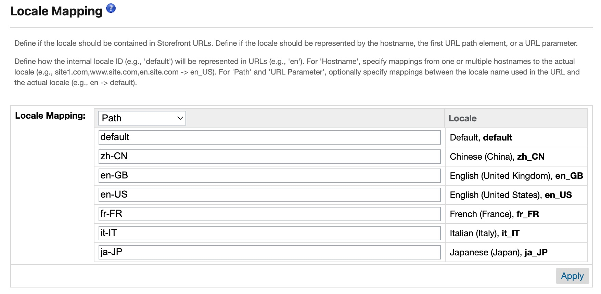
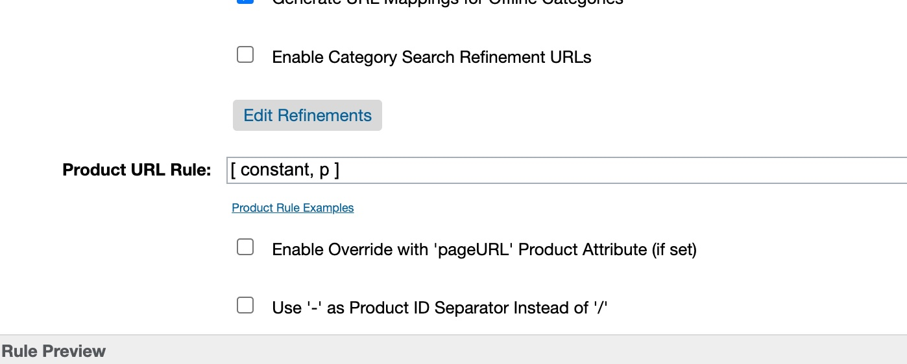

# Headless Reference Architecture (HRA)
[](https://github.com/taurgis/headless-reference-architecture/actions/workflows/build-test.yml) [](https://codecov.io/gh/taurgis/headless-reference-architecture) [](https://opensource.org/licenses/ISC)


This is a repository for the Headless Reference Architecture reference application, based on the Storefront Reference Architecture.

Headless Reference Architecture has a base cartridge (`app_api_base`) that is never directly customized or edited. Instead, customization cartridges are layered on top of the base cartridge. This change is intended to allow for easier adoption of new features and bug fixes.

Your feedback on the ease-of-use and limitations of this new architecture is invaluable during the developer preview. Particularly, feedback on any issues you encounter or workarounds you develop for efficiently customizing the base cartridge without editing it directly.


# The latest version

The latest version of HRA is 0.1.0

# Getting Started

1. Clone this repository.

2. Run `npm install` to install all of the local dependencies (SFRA has been tested with v12.21.0 and is recommended)

3. Create `dw.json` file in the root of the project. Providing a [WebDAV access key from BM](https://documentation.b2c.commercecloud.salesforce.com/DOC1/index.jsp?topic=%2Fcom.demandware.dochelp%2Fcontent%2Fb2c_commerce%2Ftopics%2Fadmin%2Fb2c_access_keys_for_business_manager.html) in the `password` field is optional, as you will be prompted if it is not provided.
```json
{
    "hostname": "your-sandbox-hostname.demandware.net",
    "username": "AM username like me.myself@company.com",
    "password": "your_webdav_access_key",
    "code-version": "version_to_upload_to"
}
```

4. Run `npm run uploadCartridge`. It will upload `app_api_base`, `bm_app_api_base`, and `modules` cartridges to the sandbox you specified in `dw.json` file.

5. Use https://github.com/SalesforceCommerceCloud/storefrontdata to zip and import site data on your sandbox.

6. Add the `app_api_base` cartridge to your cartridge path in _Administration >  Sites >  Manage Sites > RefArch - Settings_ (Note: This should already be populated by the sample data in Step 5).

8. You should now be ready to use the new endpoints

# NPM scripts
Use the provided NPM scripts to upload changes to your Sandbox.

## Linting your code

`npm run lint` - Execute linting for all JavaScript and SCSS files in the project. You should run this command before committing your code.

## Watching for changes and uploading

`npm run watch` - Watches everything and recompiles (if necessary) and uploads to the sandbox. Requires a valid `dw.json` file at the root that is configured for the sandbox to upload.

## Uploading

`npm run uploadCartridge` - Will upload `app_api_base` and `modules` to the server. Requires a valid `dw.json` file at the root that is configured for the sandbox to upload.

`npm run upload <filepath>` - Will upload a given file to the server. Requires a valid `dw.json` file.

# Testing
## Running unit tests

You can run `npm test` to execute all unit tests in the project. Run `npm run cover` to get coverage information. Coverage will be available in `coverage` folder under root directory.

* UNIT test code coverage:
1. Open a terminal and navigate to the root directory of the mfsg repository.
2. Enter the command: `npm run cover`.
3. Examine the report that is generated. For example: `Writing coverage reports at [/Users/yourusername/SCC/sfra/coverage]`
3. Navigate to this directory on your local machine, open up the index.html file. This file contains a detailed report.

## Running integration tests
Integration tests are located in the `storefront-reference-architecture/test/integration` directory.

To run integration tests you can use the following command:

```
npm run test:integration
```

**Note:** Please note that short form of this command will try to locate URL of your sandbox by reading `dw.json` file in the root directory of your project. If you don't have `dw.json` file, integration tests will fail.
sample `dw.json` file (this file needs to be in the root of your project)
{
    "hostname": "devxx-sitegenesis-dw.demandware.net"
}

You can also supply URL of the sandbox on the command line:

```
npm run test:integration -- --baseUrl devxx-sitegenesis-dw.demandware.net
```
# Performance Monitoring
The HRA adds a special header called `x-sf-cc-server-timing` to all responses that are not cached. This allows for tracking and troubleshooting of performance.

Here's an example of what the value might look like:

```
x-sf-cc-server-timing: script;dur=1076, Route-Step-1;dur=1075, render;dur=1
```

The value is made up of different metrics:

* **script**: the amount of time it takes for a route to be processed, not including the time it takes to render the JSON or basic print.
* **Route-Step-X**: each part of the route will have its own metrics, including prepends, appends, and middleware.
* **Render**: the total time it takes to render the request, including JSON or print.

# SEO: Search Driven Redirects
The Business Manager module to configure search driven redirects (`Merchant Tools > Search > Search Driven Redirects`) has been exposed to the following endpoint:
* Product Search: `/search/shopper-search/v1/organizations/{{organization}}/product-search`

## Hacky way in Search
The custom hook will remove all product results from the response, replacing it with a single result with the attribute "c_redirect". The reasoning is that the SCAPI adheres closely to the rules of the endpoint, meaning that no custom attributes can be placed in the top level, and all custom fields need to start with `c_`. 

For now, it is also impossible to adjust headers or anything else that would make more sense.

# SEO: Page Meta Tag Rules
The Business Manager module to manage all of the Meta Tags dynamically for a page have been exposed to the following endpoints:
* Product Detail (`/product/shopper-products/v1/organizations/{{organization}}/products`)
* Category (`/product/shopper-products/v1/organizations/{{organization}}/categories/{{category}}`)

## Hacky way in Search
Besides these, the search endpoint (`/search/shopper-search/v1/organizations/{{organization}}/product-search`) has also been extended with this information. Unfortunately, it is not possible to set a custom (c_) attribute at the top level, so it has been stored on the first "hit":

```
{
    "limit": 25,
    "hits": [
        {
           ...
            "c_metadata": [
                {
                    "ID": "robots",
                    "content": "index,follow",
                    "name": true,
                    "property": false,
                    "title": false
                },
                {
                    "ID": "og:url",
                    "content": "...",
                    "name": false,
                    "property": true,
                    "title": false
                },
                {
                    "ID": "title",
                    "content": "Find amazing products in Storefront Catalog - Non-EN' today | RefArchGlobal",
                    "name": false,
                    "property": false,
                    "title": true
                }
            ],
            ...
        },
        ...
    ]
}
```

# SEO: Sitemap

In this project, the "Sitemap" controller is present to enable using the standard sitemap functionality that Salesforce B2C Commerce Cloud provides.

To work with the Composable Storefront, changes need to be made to the URL generation, matching the configuration in the Business Manager.

## Example
### Business Manager
_**NOTE**: URL Rules can be found here: `Merchant Tools > SEO > URL Rules`_
#### URL Rules: Settings

In the "Locale Mapping" settings select the type `Path` and fill in the corresponding values for each locale.

e.g. "English (United States), en_US" should have the value `en-US`
___

#### URL Rules: Catalog URLs

In the Product URL Rule field, fill in the following value:
```
[ constant, p ]
```

Make sure to uncheck the "Enable Override with 'pageURL' Product Attribute (if set)".
___
#### Sitemap

The Sitemap generation can be done here:

___
#### Alias & ECDN
As all projects are unique in their set-up, the final step is to make sure the sitemap is generated using your own domain by configuring the aliases.

```Merchant Tools > SEO > Aliases```

**Documentation**: [https://documentation.b2c.commercecloud.salesforce.com/DOC2/topic/com.demandware.dochelp/content/b2c_commerce/topics/search_engine_optimization/b2c_hostname_aliases.html](https://documentation.b2c.commercecloud.salesforce.com/DOC2/topic/com.demandware.dochelp/content/b2c_commerce/topics/search_engine_optimization/b2c_hostname_aliases.html)

`Merchant Tools > SEO > Sitemaps`

### Composable Storefront
#### app/routes.jsx
Change the route for the ProductDetail page to the following:
```
{
    path: '/p/:productId.html',
    component: ProductDetail
}
```

_**Note**: .html is necessary, as this can not be removed in the settings._

___
#### config/default.js
In order to match our Business Manager config, the `app.url.locale` setting must be `path` and the `app.url.showDefaults` setting must be `true`.
```
module.exports = {
    app: {
        // Customize how your 'site' and 'locale' are displayed in the url.
        url: {
            // Determine where the siteRef is located. Valid values include 'path|query_param|none'. Defaults to: 'none'
            // site: 'none',
            // Determine where the localeRef is located. Valid values include 'path|query_param|none'. Defaults to: 'none'
            locale: 'path',
            // This boolean value dictates whether or not default site or locale values are shown in the url. Defaults to: false
            showDefaults: true
        },
        ...
    }
}
```
___
#### app/utils/url.js
Modify the productUrlBuilder function to match the one below:

```
export const productUrlBuilder = (product) => encodeURI(`/p/${product.id}.html`)
```

# [Contributing to HRA](./CONTRIBUTING.md)
